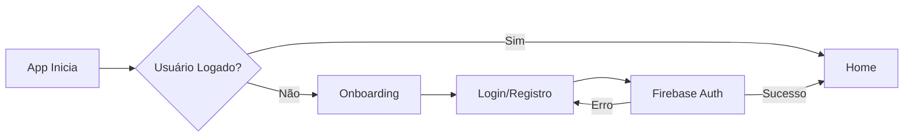

# 🌟 Equilíbrio

> **Seu companheiro diário para saúde, bem-estar e finanças em harmonia**

[](https://reactnative.dev/)
[](https://expo.dev/)
[](https://www.typescriptlang.org/)
[](https://firebase.google.com/)
[](LICENSE)

<p align="center">
  
  
  
  
</p>

---

## 📋 Índice

- [Sobre](#-sobre)
- [Funcionalidades](#-funcionalidades)
- [Tecnologias](#-tecnologias)
- [Pré-requisitos](#-pré-requisitos)
- [Instalação](#-instalação)
- [Configuração](#-configuração)
- [Executando o Projeto](#-executando-o-projeto)
- [Estrutura do Projeto](#-estrutura-do-projeto)
- [Funcionalidades Detalhadas](#-funcionalidades-detalhadas)
- [Arquitetura](#-arquitetura)
- [Testes](#-testes)
- [Deploy](#-deploy)
- [Contribuindo](#-contribuindo)
- [Licença](#-licença)
- [Contato](#-contato)

---

## 🎯 Sobre

**Equilíbrio** é um aplicativo mobile que integra três pilares fundamentais da vida moderna:

- 💚 **Saúde & Bem-estar**: Meditação, exercícios e mindfulness
- 💰 **Finanças Pessoais**: Controle de gastos e orçamento
- 📊 **Métricas Inteligentes**: Score de equilíbrio diário baseado em seus hábitos

O app calcula um **Score de Equilíbrio** (0-100) baseado em:
- Qualidade do sono
- Estado emocional
- Atividade física
- Saúde financeira

---

## ✨ Funcionalidades

### 🏠 **Dashboard Principal**
- Score de equilíbrio em tempo real
- Visualização circular animada
- Métricas de sono, humor, atividade e finanças
- Insights personalizados baseados em IA
- Atualização automática ao navegar

### ✅ **Check-in Diário**
- Registro de horas de sono (1-12h)
- Avaliação de humor (1-5 estrelas)
- Consumo de água (copos)
- Atividade física (sim/não)
- Gasto rápido integrado com finanças
- Validações inteligentes
- Histórico completo

### 🧘 **Bem-estar**
- Timer de meditação (5, 10, 15 min)
- Exercícios de respiração guiada
- Yoga e alongamento
- Sistema de streak (sequência de dias)
- Conquistas e badges
- Histórico de atividades

### 💰 **Finanças**
- Controle de receitas e despesas
- Orçamento mensal editável
- Categorização automática (5 categorias)
- Gráfico de pizza interativo
- Lista de transações com edição/exclusão
- Integração com check-in diário
- Cálculo de saldo em tempo real

### 👤 **Perfil**
- Edição de nome e avatar
- Stats reais (score médio, dias ativos, conquistas)
- Sistema de badges e conquistas
- Notificações push configuráveis
- Modo escuro (em desenvolvimento)
- Logout seguro

### 🔔 **Notificações**
- Lembrete de check-in diário (20h)
- Lembrete de meditação (9h)
- Permissões gerenciadas
- Ativação/desativação fácil

---

## 🛠️ Tecnologias

### **Core**
- [React Native](https://reactnative.dev/) - Framework mobile
- [Expo](https://expo.dev/) - Plataforma de desenvolvimento
- [TypeScript](https://www.typescriptlang.org/) - Tipagem estática

### **UI/UX**
- [React Native Reanimated](https://docs.swmansion.com/react-native-reanimated/) - Animações fluidas
- [Expo Linear Gradient](https://docs.expo.dev/versions/latest/sdk/linear-gradient/) - Gradientes
- [React Native SVG](https://github.com/software-mansion/react-native-svg) - Gráficos vetoriais
- [React Native Chart Kit](https://github.com/indiespirit/react-native-chart-kit) - Gráficos
- [Ionicons](https://ionic.io/ionicons) - Ícones

### **Backend & Autenticação**
- [Firebase Authentication](https://firebase.google.com/docs/auth) - Autenticação de usuários
- [Firebase Firestore](https://firebase.google.com/docs/firestore) - Banco de dados NoSQL
- [AsyncStorage](https://react-native-async-storage.github.io/async-storage/) - Persistência local

### **Navegação**
- [React Navigation](https://reactnavigation.org/) - Navegação entre telas
- [Bottom Tabs Navigator](https://reactnavigation.org/docs/bottom-tab-navigator/) - Barra de navegação

### **Notificações**
- [Expo Notifications](https://docs.expo.dev/versions/latest/sdk/notifications/) - Push notifications

### **Utilitários**
- [React Native Community Slider](https://github.com/callstack/react-native-slider) - Sliders
- Sistema de responsividade customizado

---

## 📦 Pré-requisitos

Antes de começar, certifique-se de ter instalado:

- **Node.js** >= 18.x ([Download](https://nodejs.org/))
- **npm** >= 9.x ou **yarn** >= 1.22.x
- **Expo CLI** (instalado globalmente)
  ```bash
  npm install -g expo-cli
  ```
- **Expo Go** no seu dispositivo móvel ([iOS](https://apps.apple.com/app/expo-go/id982107779) | [Android](https://play.google.com/store/apps/details?id=host.exp.exponent))
- **Conta Firebase** ([Console](https://console.firebase.google.com/))

### **Opcional (para desenvolvimento)**
- **Android Studio** (para emulador Android)
- **Xcode** (para emulador iOS - apenas macOS)
- **Git** para controle de versão

---

## 🚀 Instalação

### **1. Clone o repositório**
```bash
git clone https://github.com/seu-usuario/windsurf-equilibrio.git
cd windsurf-equilibrio
```

### **2. Instale as dependências**
```bash
npm install
# ou
yarn install
```

### **3. Configure as variáveis de ambiente**
```bash
cp env.example .env
```

Edite o arquivo `.env` com suas credenciais do Firebase:
```env
EXPO_PUBLIC_FIREBASE_API_KEY=sua_api_key
EXPO_PUBLIC_FIREBASE_AUTH_DOMAIN=seu_projeto.firebaseapp.com
EXPO_PUBLIC_FIREBASE_PROJECT_ID=seu_projeto_id
EXPO_PUBLIC_FIREBASE_STORAGE_BUCKET=seu_projeto.appspot.com
EXPO_PUBLIC_FIREBASE_MESSAGING_SENDER_ID=seu_sender_id
EXPO_PUBLIC_FIREBASE_APP_ID=seu_app_id
EXPO_PUBLIC_FIREBASE_MEASUREMENT_ID=seu_measurement_id
EXPO_PUBLIC_APP_ENV=development
EXPO_PUBLIC_DEFAULT_LOCALE=pt-BR
```

---

## ⚙️ Configuração

### **Firebase Setup**

1. **Crie um projeto no [Firebase Console](https://console.firebase.google.com/)**

2. **Ative a autenticação por email/senha:**
   - Vá em Authentication > Sign-in method
   - Ative "Email/Password"

3. **Configure o Firestore (opcional):**
   - Vá em Firestore Database
   - Crie um banco de dados
   - Configure as regras de segurança

4. **Copie as credenciais:**
   - Vá em Project Settings > General
   - Adicione um app Web
   - Copie as credenciais para o `.env`

### **Notificações Push**

Para notificações funcionarem:

1. **iOS**: Requer Apple Developer Account
2. **Android**: Funciona automaticamente com Expo Go
3. **Produção**: Configure FCM no Firebase

Veja [AUTH_SETUP.md](AUTH_SETUP.md) para instruções detalhadas.

---

## 🎮 Executando o Projeto

### **Modo Desenvolvimento**

```bash
# Inicia o servidor Expo
npm start
# ou
expnpx expo start
```

### **Executar em dispositivo específico**

```bash
# Android
npm run android

# iOS (apenas macOS)
npm run ios

# Web (experimental)
npm run web
```

### **Escanear QR Code**

1. Abra o **Expo Go** no seu celular
2. Escaneie o QR code que aparece no terminal
3. Aguarde o app carregar

### **Limpar cache**

```bash
npm start -- --clear
```

---

## 📁 Estrutura do Projeto

```
windsurf-equilibrio/
├── .expo/                  # Arquivos de configuração do Expo
├── .github/                # GitHub Actions e templates
├── assets/                 # Imagens, fontes e ícones
│   ├── images/
│   └── fonts/
├── src/
│   ├── components/         # Componentes reutilizáveis
│   │   ├── Badge.tsx
│   │   ├── Button.tsx
│   │   ├── Card.tsx
│   │   └── index.ts
│   ├── navigation/         # Configuração de navegação
│   │   ├── AuthNavigator.tsx
│   │   └── index.tsx
│   ├── screens/            # Telas do aplicativo
│   │   ├── HomeScreen.tsx
│   │   ├── CheckinScreen.tsx
│   │   ├── WellnessScreen.tsx
│   │   ├── FinanceScreen.tsx
│   │   ├── ProfileScreen.tsx
│   │   ├── LoginScreen.tsx
│   │   ├── RegisterScreen.tsx
│   │   └── OnboardingScreen.tsx
│   ├── services/           # Serviços e APIs
│   │   ├── auth.ts
│   │   ├── firebase.ts
│   │   └── notifications.ts
│   ├── theme/              # Tema e estilos globais
│   │   └── index.ts
│   ├── utils/              # Utilitários e helpers
│   │   └── responsive.ts
│   └── types/              # Tipos TypeScript
├── .env                    # Variáveis de ambiente (não commitado)
├── .env.example            # Exemplo de variáveis
├── .gitignore
├── app.json                # Configuração do Expo
├── babel.config.js
├── package.json
├── tsconfig.json
├── AUTH_SETUP.md           # Guia de autenticação
├── DESIGN.md               # Guia de design
├── SCREENS_OVERVIEW.md     # Visão geral das telas
└── README.md               # Este arquivo
```

---

## 🎨 Funcionalidades Detalhadas

### **Sistema de Score**

O Score de Equilíbrio (0-100) é calculado com base em:

```typescript
// Sono (0-10 pontos)
- 7-9h: 10 pontos
- 6-10h: 7 pontos
- Outros: 4 pontos

// Humor (0-10 pontos)
- Valor do check-in × 2

// Atividade (0-10 pontos)
- Física: 10 pontos
- Wellness: +2 por atividade

// Finanças (0-10 pontos)
- Saldo > 0: 10 pontos
- Saldo > -500: 7 pontos
- Outros: 4 pontos

// Score Final
Score = (sono + humor + atividade + finanças) × 2.5
```

### **Persistência de Dados**

**AsyncStorage Keys:**
```typescript
// Check-ins
checkin_YYYY-MM-DD              // Check-in do dia
checkin_history_{userId}        // Histórico completo

// Finanças
transactions_{userId}           // Todas as transações
budget_{userId}                 // Orçamento mensal

// Bem-estar
wellness_activities_{userId}_YYYY-MM-DD  // Atividades do dia
wellness_streak_{userId}        // Sequência de dias
```

### **Fluxo de Autenticação**



---

## 🏗️ Arquitetura

### **Padrões Utilizados**

- **Component-Based Architecture**: Componentes reutilizáveis e modulares
- **Hooks Pattern**: useState, useEffect, useFocusEffect
- **Service Layer**: Separação de lógica de negócio
- **Theme System**: Centralização de cores e estilos
- **Responsive Design**: Adaptação automática a diferentes telas

### **Fluxo de Dados**

```
Usuário → Tela → Service → AsyncStorage/Firebase → Tela → UI
```

### **Responsividade**

Sistema customizado baseado em:
- Dimensões da tela
- Detecção de dispositivo (pequeno/médio/grande/tablet)
- SafeAreaView para notch/status bar
- Escalas dinâmicas de largura/altura

---

## 🧪 Testes

### **Executar testes**

```bash
# Testes unitários
npm test

# Testes com coverage
npm run test:coverage

# Testes E2E (requer configuração)
npm run test:e2e
```

### **Testar em dispositivos**

- **iPhone SE** (pequeno)
- **iPhone 11/12/13** (médio)
- **iPhone 14 Pro Max** (grande)
- **iPad** (tablet)
- **Android 10+** (diversos tamanhos)

---

## 📱 Deploy

### **Build de Produção**

```bash
# Configurar EAS
eas build:configure

# Build para Android
eas build --platform android

# Build para iOS
eas build --platform ios

# Build para ambos
eas build --platform all
```

### **Publicar Update OTA**

```bash
# Publicar atualização
eas update --branch production
```

### **Submeter para Stores**

```bash
# Google Play Store
eas submit --platform android

# Apple App Store
eas submit --platform ios
```

Veja [Expo EAS Documentation](https://docs.expo.dev/eas/) para mais detalhes.

---

## 🤝 Contribuindo

Contribuições são bem-vindas! Siga os passos:

1. **Fork o projeto**
2. **Crie uma branch** (`git checkout -b feature/NovaFuncionalidade`)
3. **Commit suas mudanças** (`git commit -m 'Adiciona nova funcionalidade'`)
4. **Push para a branch** (`git push origin feature/NovaFuncionalidade`)
5. **Abra um Pull Request**

### **Diretrizes**

- Siga o estilo de código existente
- Adicione testes para novas funcionalidades
- Atualize a documentação
- Use commits semânticos (feat, fix, docs, etc)

---

## 📄 Licença

Este projeto está sob a licença MIT. Veja o arquivo [LICENSE](LICENSE) para mais detalhes.

---

## 👨‍💻 Autor

**Seu Nome**
- GitHub: [@seu-usuario](https://github.com/seu-usuario)
- LinkedIn: [Seu Nome](https://linkedin.com/in/seu-perfil)
- Email: seu.email@example.com

---

## 🙏 Agradecimentos

- [Expo Team](https://expo.dev/) - Pela incrível plataforma
- [React Native Community](https://reactnative.dev/) - Pelo framework
- [Firebase](https://firebase.google.com/) - Pelos serviços backend
- Todos os contribuidores e testadores

---

## 📊 Status do Projeto

- ✅ **v1.0.0** - MVP completo
- ✅ Autenticação Firebase
- ✅ Check-in diário
- ✅ Sistema de bem-estar
- ✅ Controle financeiro
- ✅ Notificações push
- ✅ Responsividade total
- 🚧 Modo escuro (em desenvolvimento)
- 🚧 Sincronização com Firestore
- 📅 Gráficos históricos (planejado)
- 📅 Exportação de dados (planejado)

---

## 🐛 Problemas Conhecidos

Veja [Issues](https://github.com/seu-usuario/windsurf-equilibrio/issues) para reportar bugs ou sugerir melhorias.

---

## 📚 Documentação Adicional

- [Guia de Autenticação](AUTH_SETUP.md)
- [Guia de Design](DESIGN.md)
- [Visão Geral das Telas](SCREENS_OVERVIEW.md)

---

<p align="center">
  Feito com ❤️ e ☕
</p>

<p align="center">
  <a href="#-equilíbrio">Voltar ao topo ⬆️</a>
</p>